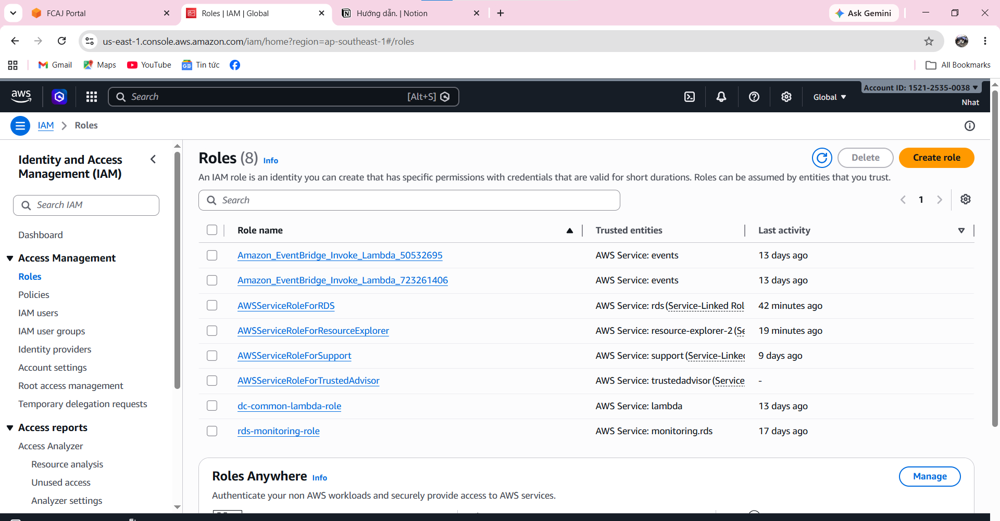
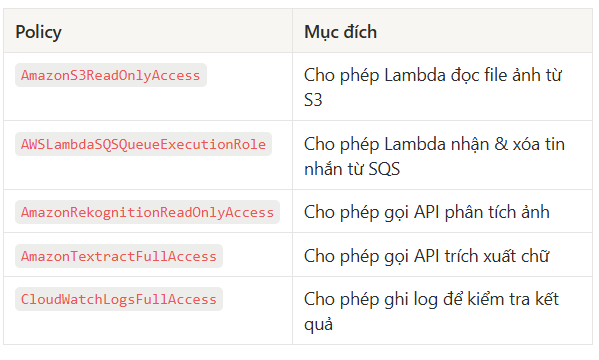
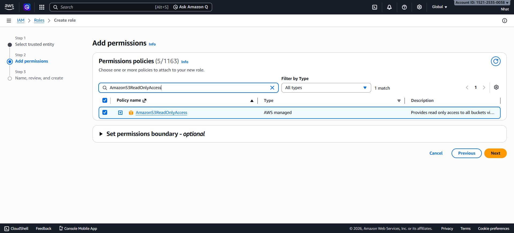
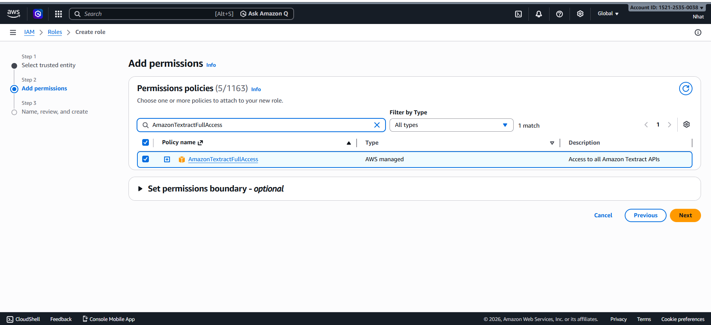
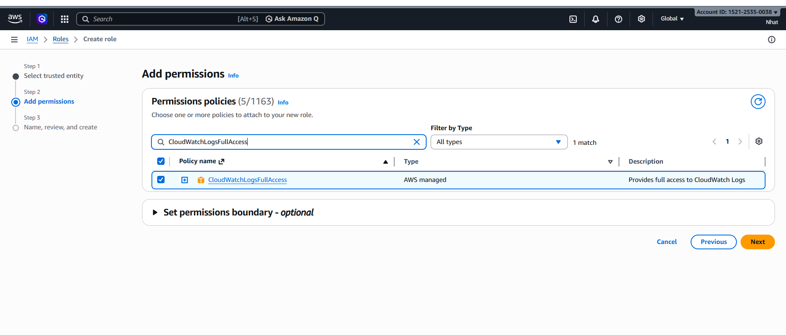
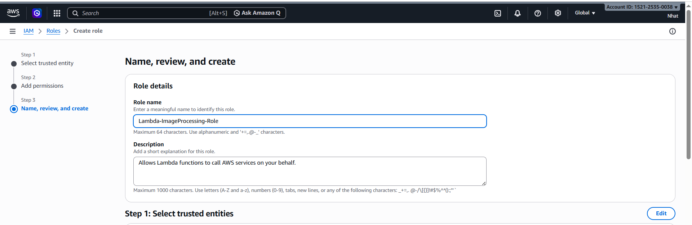
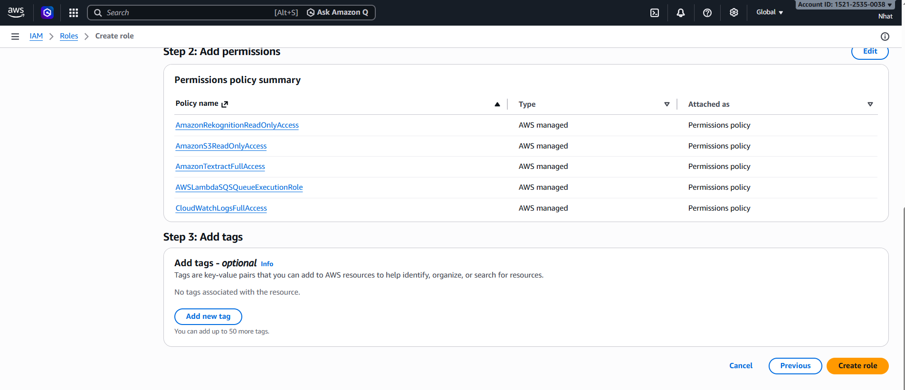
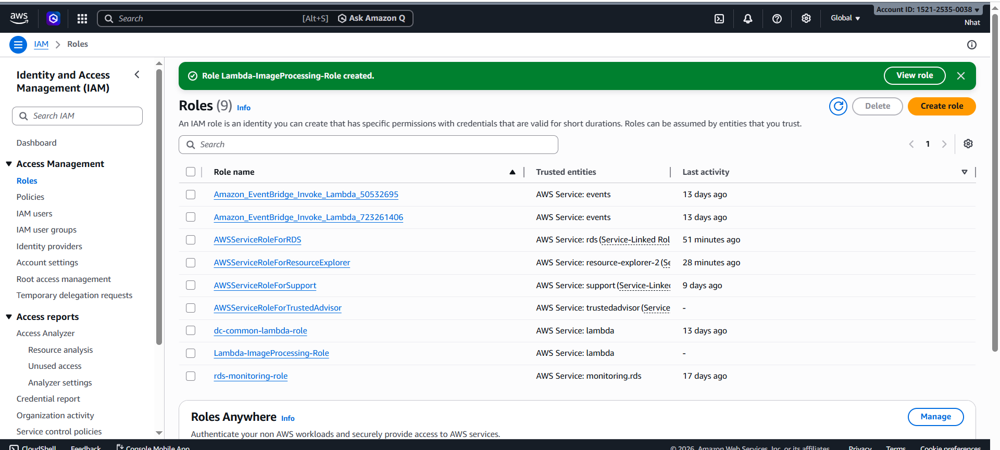

# Step 1: Prepare the IAM Role for Lambda

### Introduction

The IAM Role is the permission that Lambda uses to access the AWS services required in the workshop, such as Amazon S3, Amazon SQS, Amazon Rekognition, and Amazon Textract.

In this step, you will create an IAM Role for Lambda and attach the necessary policies so that Lambda can read data, receive messages, and write logs during image processing.

---

### Procedure

1. Go to the AWS Console and open the IAM service.

2. Select Roles, then choose Create role.

3. In the Trusted entity type section, select AWS service.

4. In the Use case section, select Lambda, then choose Next.

5. Find and attach the policies needed for Lambda one by one.

6. Name the role Lambda-ImageProcessing-Role, then choose Create role.

---

### Security Note

In real-world environments, rather than using AWS-managed policies, you should create a Custom Policy to limit permissions to only the specific bucket or queue needed.

This is a security best practice following the Least Privilege principle, meaning you grant only the permissions required and nothing extra.

