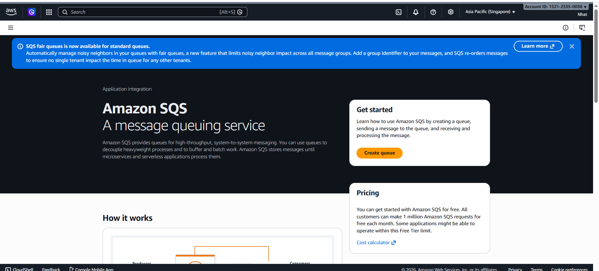
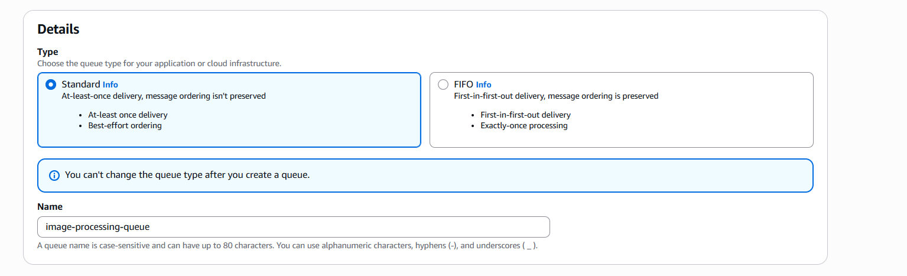
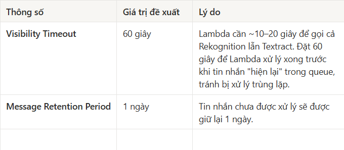
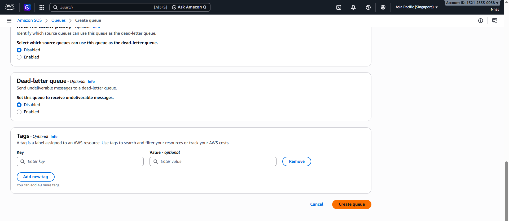

# Step 2: Create an Amazon SQS Message Queue

### Introduction

Amazon SQS serves as the intermediary queue between Amazon S3 and AWS Lambda.

When users upload images to S3, S3 sends notifications to SQS. Lambda then reads messages from SQS and processes them gradually, making the system more stable when many images are uploaded at the same time.

---

### Procedure

1. Go to the AWS Console, open the Amazon SQS service, and choose Create queue.

2. Choose the queue type as Standard Queue.

Do not choose FIFO Queue for this workshop because the goal is asynchronous image processing with high scalability, without strict ordering requirements.

3. Name the queue image-processing-queue.

4. Configure the important queue parameters.

5. Choose Create queue to create the queue.

6. After creation, copy the queue ARN. This ARN will be used in the next step to configure the S3 Event Notification.

