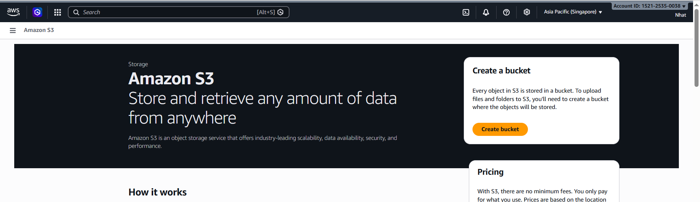
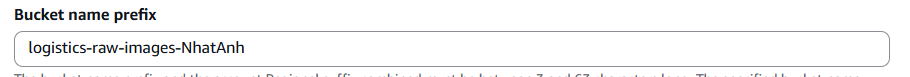
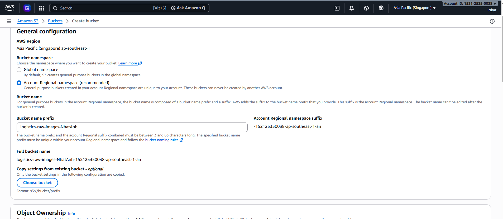
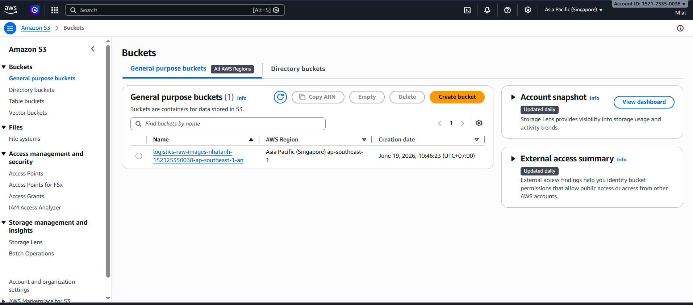
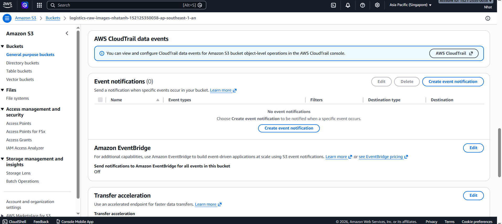
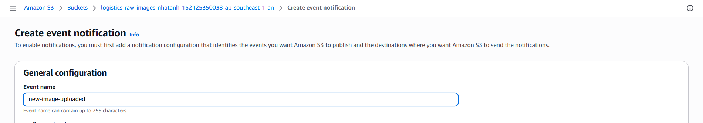
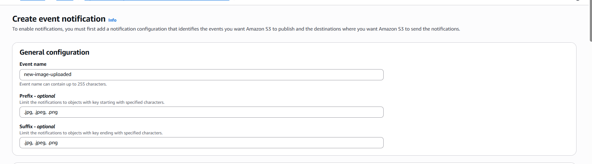

# Step 3: Configure Amazon S3 Storage and Events

### Objective

In this step, you will create an S3 bucket to store images and configure it so that whenever a new image is uploaded, Amazon S3 automatically sends a notification to the SQS queue created in the previous step.

---

### 3.1 - Create an S3 Bucket

1. Go to Amazon S3 and choose Create bucket.



2. Name the bucket using the format logistics-raw-images-<your-name>.

The bucket name must be unique across all AWS accounts.



3. Choose the Region ap-southeast-1 (Singapore) to be closer to Vietnam.



4. Keep the default settings and choose Create bucket.


---

### 3.2 - Grant Permission for S3 to Send Notifications to SQS

1. Open the SQS Console and select the queue image-processing-queue.

2. Open the Access policy tab and edit the policy.

3. Add a policy that allows S3 to send messages to SQS.


Example policy:

```json
{
  "Version": "2012-10-17",
  "Statement": [
    {
      "Effect": "Allow",
      "Principal": {
        "Service": "s3.amazonaws.com"
      },
      "Action": "sqs:SendMessage",
      "Resource": "arn:aws:sqs:ap-southeast-1:<account-id>:image-processing-queue",
      "Condition": {
        "ArnLike": {
          "aws:SourceArn": "arn:aws:s3:::logistics-raw-images-<your-name>"
        }
      }
    }
  ]
}
```

Replace <account-id> with your AWS Account ID and logistics-raw-images-<your-name> with the bucket name you created.


---

### 3.3 - Configure S3 Event Notification

1. Open the bucket you created, go to the Properties tab, scroll down to Event notifications, and choose Create event notification.





2. Name the event new-image-uploaded.



3. Under Event types, select s3:ObjectCreated:*.


4. Under Prefix/Suffix, enter image suffixes such as .jpg, .jpeg, and .png so the rule only triggers for uploaded images.

This configuration helps ignore files that are not images, such as .txt or .pdf.



5. Under Destination, select SQS Queue and then choose the image-processing-queue.


6. Choose Save changes to save the configuration.


