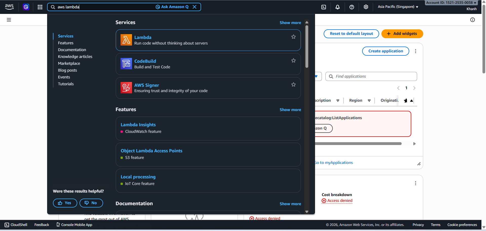
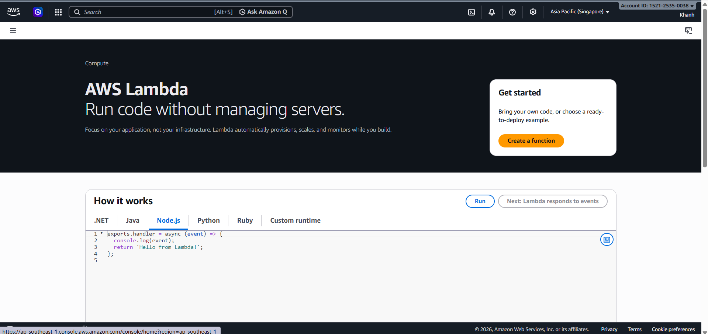
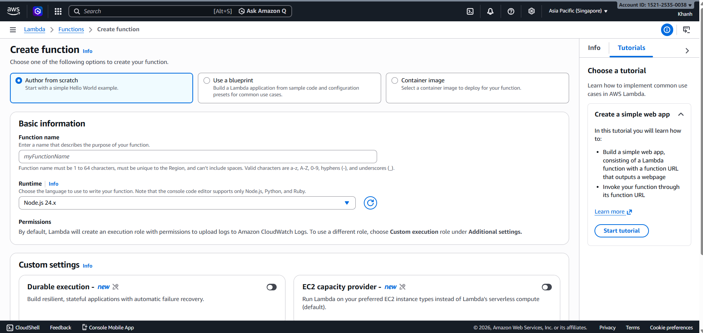
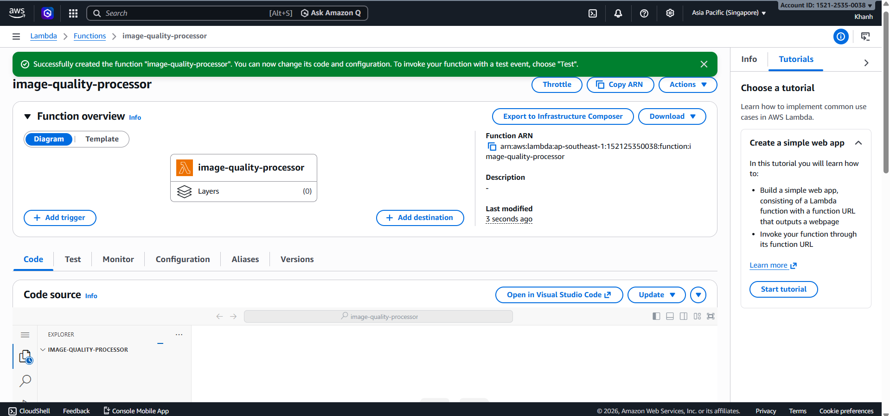
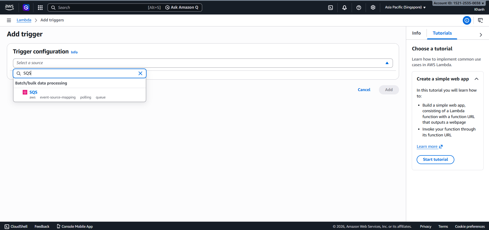
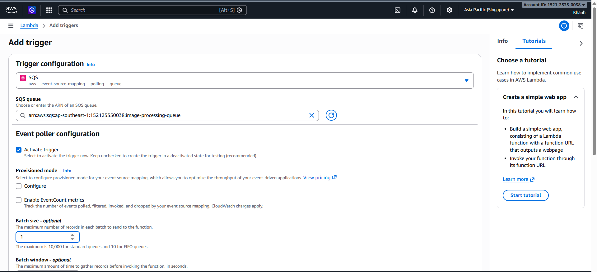
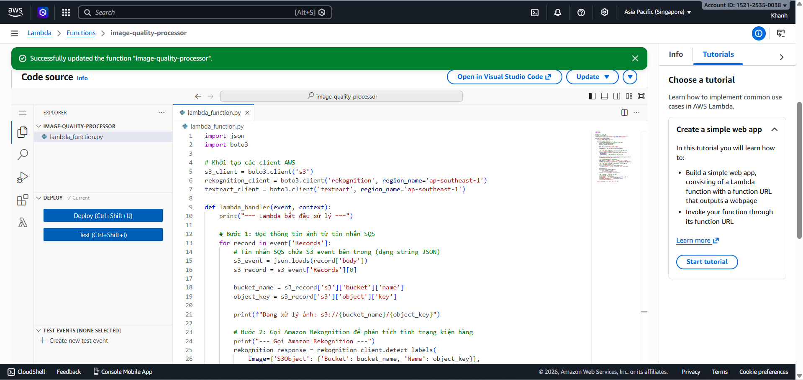

# Step 4: Create and Write Code for AWS Lambda

### Objective

In this step, you will create a Lambda Function to receive messages from Amazon SQS, read information about images uploaded to Amazon S3, and call AI services such as Amazon Rekognition and Amazon Textract to analyze the images.

---

### 4.1 - Create the Lambda Function

1. Go to AWS Lambda and choose Create function.



2. Choose Author from scratch.





3. Configure the Lambda Function.


Suggested configuration:

- Function name: image-quality-processor
- Runtime: Python 3.x
- Execution role: choose the IAM Role Lambda-ImageProcessing-Role created in Step 1

4. Choose Create function.



5. Open the Configuration tab, select General configuration, and choose Edit.


6. Set Timeout = 60 seconds, then save the configuration.


---

### 4.2 - Attach SQS as a Trigger

1. On the Lambda Function page, choose Add trigger.


2. Choose SQS as the source.



3. Select the image-processing-queue.

4. Configure Batch size = 1.

A batch size of 1 helps Lambda process one message at a time, which is suitable for the lab because it makes logs and debugging easier.

5. Choose Add.



---

### 4.3 - Write the Python Code

1. Open the Code tab.

2. Delete the sample code, paste the Python code that processes SQS messages, then choose Deploy to save the code.



Sample code:

```python
import json
import urllib.parse

import boto3

s3 = boto3.client("s3")
rekognition = boto3.client("rekognition")
textract = boto3.client("textract")


def lambda_handler(event, context):
    for record in event["Records"]:
        body = json.loads(record["body"])

        for s3_record in body.get("Records", []):
            bucket = s3_record["s3"]["bucket"]["name"]
            key = urllib.parse.unquote_plus(s3_record["s3"]["object"]["key"])

            print(f"Processing image: s3://{bucket}/{key}")

            labels = rekognition.detect_labels(
                Image={
                    "S3Object": {
                        "Bucket": bucket,
                        "Name": key
                    }
                },
                MaxLabels=10,
                MinConfidence=70
            )

            print("Rekognition labels:")
            for label in labels["Labels"]:
                print(f"- {label['Name']}: {label['Confidence']:.2f}%")

            text_result = textract.detect_document_text(
                Document={
                    "S3Object": {
                        "Bucket": bucket,
                        "Name": key
                    }
                }
            )

            print("Textract text:")
            for block in text_result["Blocks"]:
                if block["BlockType"] == "LINE":
                    print(block["Text"])

    return {
        "statusCode": 200,
        "body": "Processed SQS messages successfully"
    }
```
