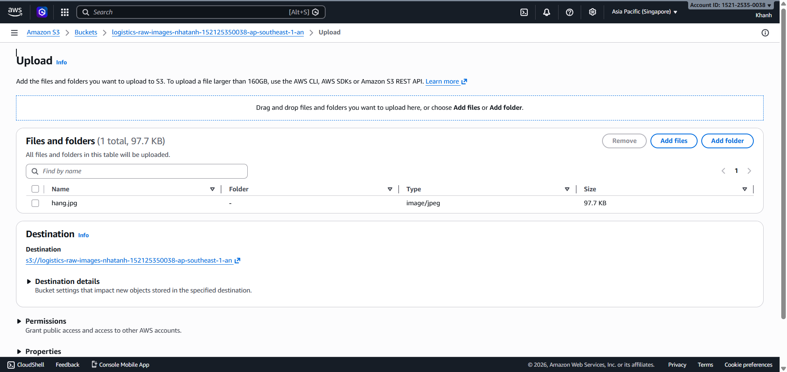
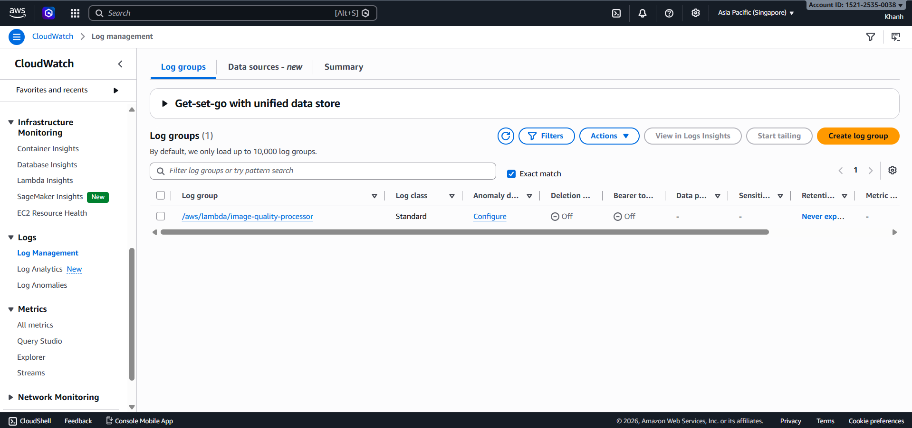
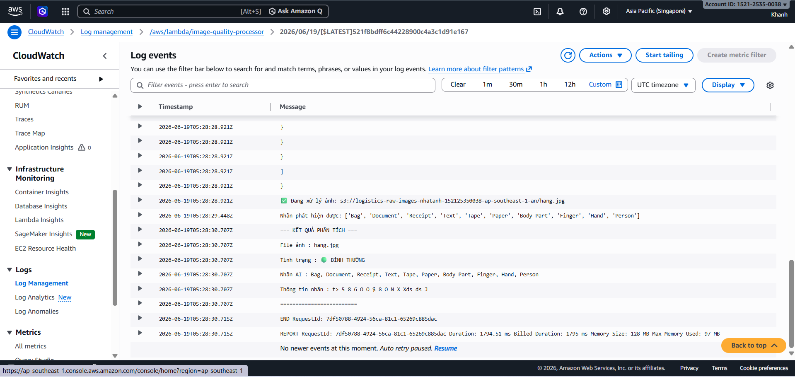
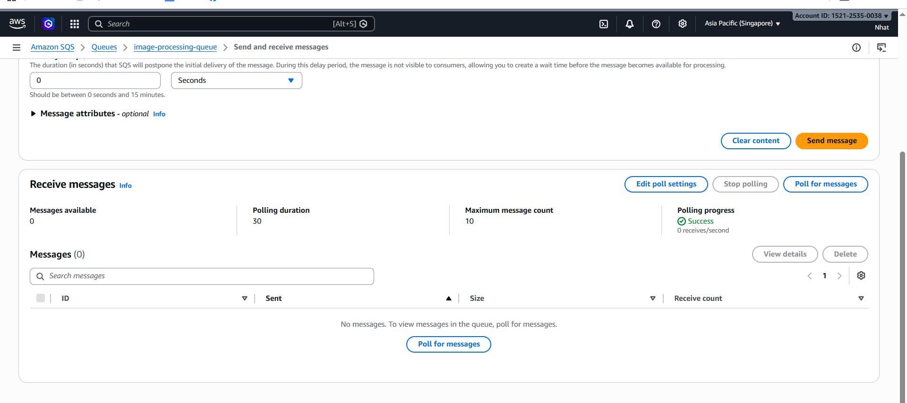

# Step 5: Test the System

### Objective

Verify that the entire flow S3 → SQS → Lambda → AI works correctly.

In this step, you will upload images to S3, check that Lambda processes messages from SQS, and review the analysis results in CloudWatch Logs.

---

### 5.1 - Prepare Test Images

Prepare at least 2 types of images:

- A damaged package image to verify that Amazon Rekognition detects the content correctly.
- An image with a label containing a clearly visible tracking number to verify that Amazon Textract extracts the text correctly.

---

### 5.2 - Upload Images to S3

1. Go to the S3 bucket logistics-raw-images-<your-name> and choose Upload.

2. Upload around 5–10 images at once to test parallel processing capability.

3. Choose Upload to start uploading the images.

---

### 5.3 - Check CloudWatch Logs

1. Go to CloudWatch and select Log groups.

2. Find the log group /aws/lambda/image-quality-processor.

3. Select the latest log stream and review the Lambda output.

---

### 5.4 - Verify SQS Has Processed All Messages

1. Go to the SQS Console and select the image-processing-queue.

2. Choose Send and receive messages.

3. Choose Poll for messages.

If the queue is empty, it means Lambda has processed all messages successfully.

